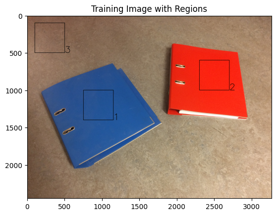
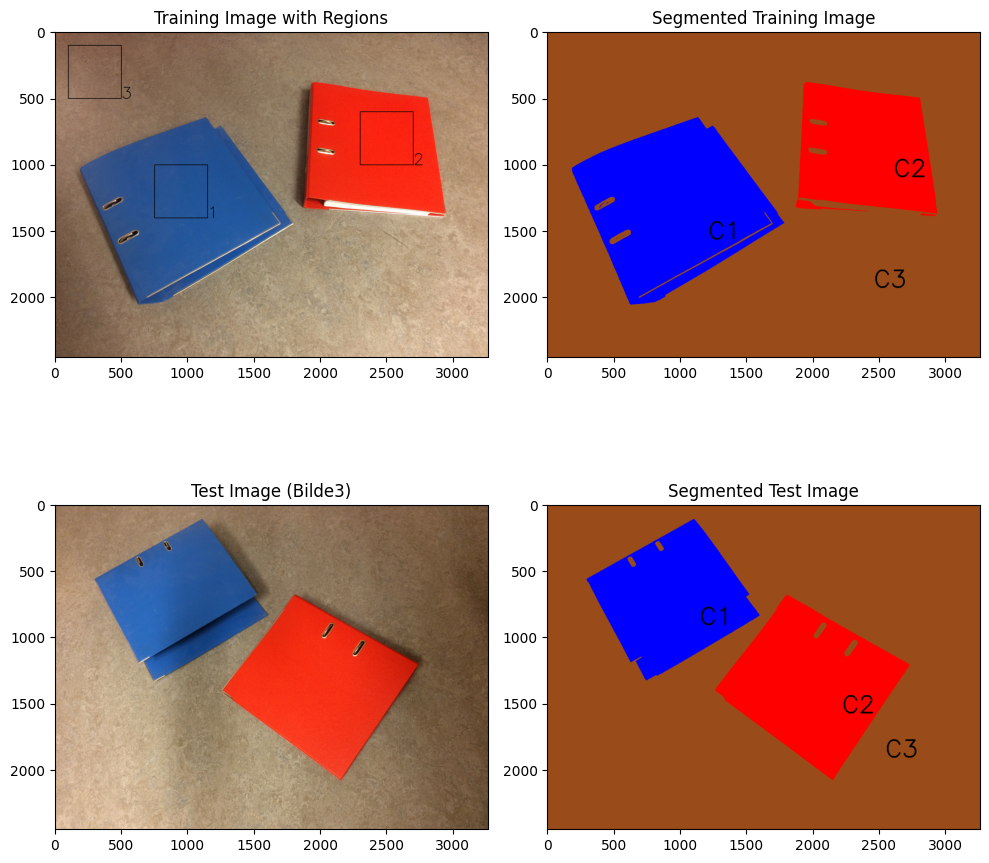
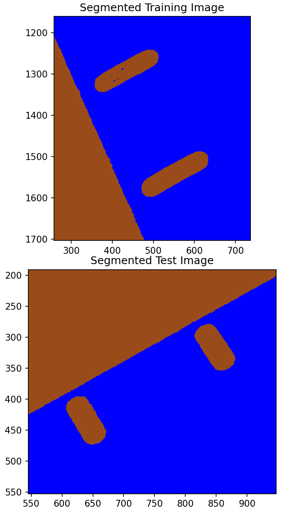
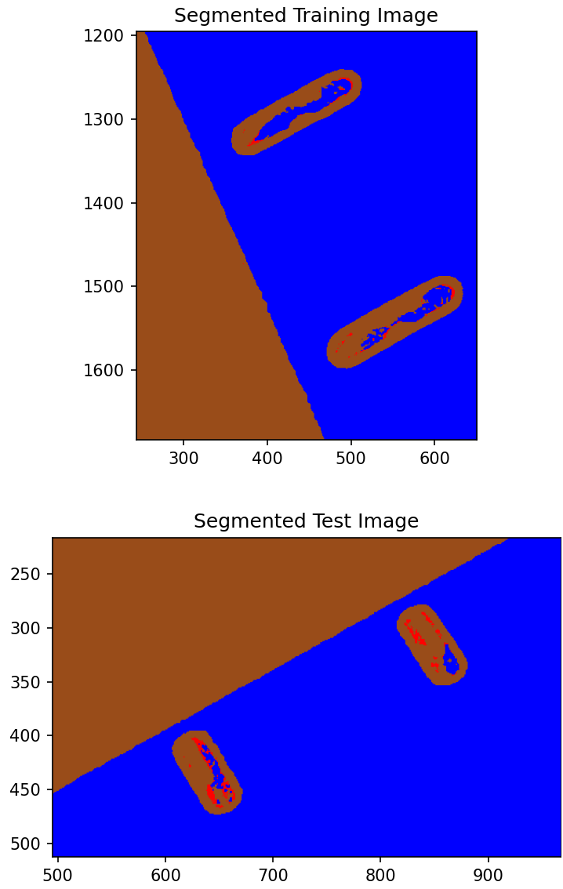
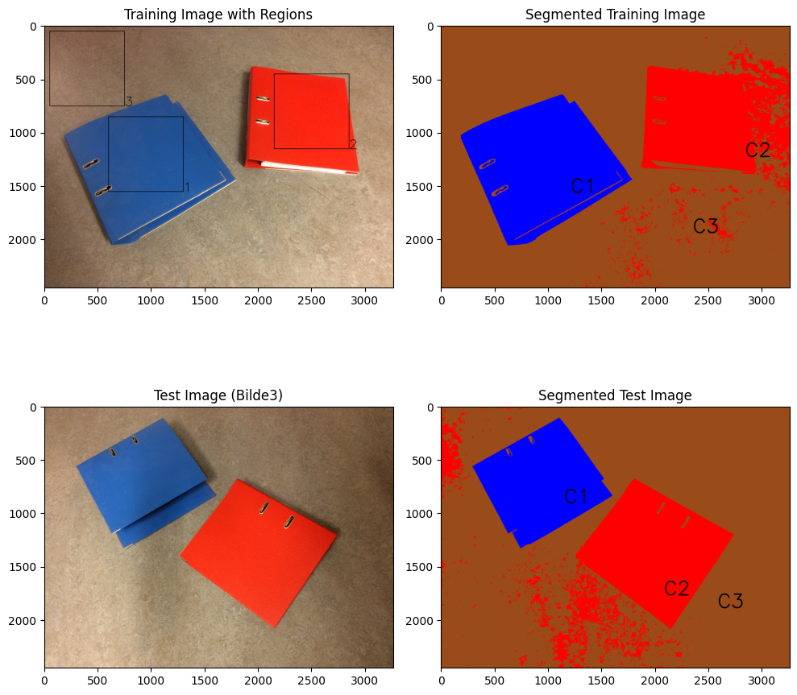
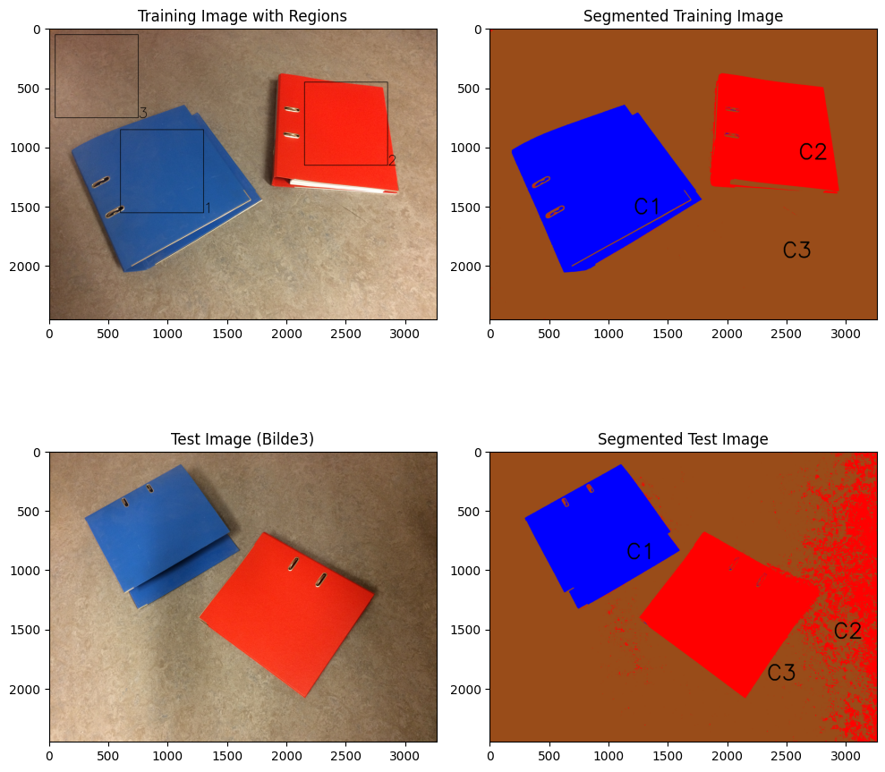

# Image Segmentation Using Color-Based Classification
**Javid Rezai**

**TEK5020**

**Code:** https://github.com/javidaf/fuzzy-fortnight.git

## Introduction

This report presents an implementation of image segmentation using color-based pixel classification techniques. The approach focuses on classifying individual pixels using their RGB color components as feature vectors, with the goal of distinguishing between different object classes in the images.

The implementation uses a minimum-error-rate classifier from project 1 and trained on manually selected regions from a training image. After training another image is used to test the classifier's performance on unseen data. The results are evaluated based on the quality of the segmentation achieved by qualitative oberservation. 

To enhance robustness against lighting variations, we employ normalized tristimulus values derived from the RGB components. This normalization helps reduce the impact of illumination changes while preserving the color information necessary for classification.

## Data
### Training Image
The image bellow (Figure 1) shows the training image used for the segmentation task. The image contains three squares representing different classes, where every pixel in each square is considered a training sample for the respective class. Class 1 contains pixels from the blue 
binder, class 2 contains pixels from the red binder, and class 3 contains pixels from the background.

*Figure 1* 

The regions are defined are equally sized squares, with $[400\times 400]$ pixels each.
### Training Image

The test image also contains the blue and red binder with same background but different position, giving it 
a little different illumination. 

*Figure 2:*

## Feature Extraction and training

The Image is is loaded having shape $[H,W,3]$, where $H$ is the height, $W$ is the width, and 3 is the number of color channels (RGB). It is then reshaped to a 2D array of shape $[H \times W, 3]$ to represent each pixel as a feature vector in the RGB space.

The classifier is experiment with both normalized and regular RGB values.

The RGB values are normalized to tristimulus values using the transformation:

$$X = [t_1 = R/(R+G+B),t_2= G/(R+G+B),t_3= B/(R+G+B)]^T$$

where $R$, $G$, and $B$ are the normalized red, green, and blue components of the pixel, respectively. The tristimulus values $t_1$ and $t_2$ are used as features for classification, while $t_3$ is omitted to avoid singularity in the covariance matrix.
Sine it is dependent on the other two values.

For the training of the classifier, only the pixels from the training regions are used. The feature vectors of these pixels are used to train the minimum-error-rate classifier, which is then used to classify all pixels in the training image and the test image.

## Results

### Data without normalization
After training the classifier, the whole images are feed to it 
for classification . The result is an image (Figure 2) that conatins 
pixel values with only three pixel colors. Blue for blue binder,red for red binder and brown for background. The classification has their corresponding class label, *C1*, *C2*, and *C3* being blue binder, red binder, and background respectively.

*Figure 2:*

The results shows well segmented binders and background.

If we zoom into the binder's rings 
we see that the classifier has almost completely segmented the ring section to background class. This is makes sence since the ring look more similar to the background 
See Figure 3.

*Figure 3:*

### Data with normalization
Results from the classifier trained with normalized RGB values are shown in Figure 4. The segmentation results are very similar to the results obtained without normalization. 

In contrast to results without normalization, the classifier with normalized RGB values has classifierd pixels in the rings as mixed class of all three classes. See Figure 5.

This is because many of the normalized pixels in binder's rings becomes more distant from the background and closer to the other classes.  

*Figure 4:*

*Figure 5:*

### Adding noise training features
In this experiment, we choose the training square reqions to be larger containing a bit of the background and a bit of the binder's ring. This is to see how the classifier will perform when the training features are not pure.

First it is experimented with non-normalized RGB values. The results are shown in Figure 6. 
We see poor results in the segmentation both for training image and test image. Since the training square of binder 2 contains a bit of the background, many of the pixels from the background are classified as binder 2.

*Figure 6:*

On the other hand, the classifier trained with normalized RGB values performs very well in the segmentation of the training image but not in the unseen image. The results are shown in Figure 7 

*Figure 7:*

## Discussion

The results demonstrate the effectiveness of the minimum-error-rate classifier for color-based image segmentation, with several key observations:

1. **Basic Performance**: The classifier successfully segments the binders and background using both normalized and non-normalized RGB values. The robustness is evident in the test image where the binders are repositioned, showing good generalization despite changes in object placement and lighting conditions.

2. **Feature Space Analysis**: The success can be attributed to the clear separation in RGB color space between the classes (blue binder, red binder, and background). This distinct color distribution creates well-defined decision boundaries in the feature space, enabling reliable classification even with a simple Gaussian model.

3. **Normalization Effects**: While RGB normalization was implemented to reduce illumination sensitivity, its impact was minimal in our controlled environment. This suggests that:
   - The lighting conditions were relatively consistent between training and test images
   - The color differences between classes were sufficiently large that illumination variations did not significantly affect class separability

4. **Limitations**: The classifier's performance is constrained by:
   - Reliance solely on pixel-wise color information, ignoring spatial relationships
   - Assumption of Gaussian distribution for class-conditional probabilities
   - Sensitivity to the selection of training regions
   - Challenges in areas with ambiguous color properties (like the binder rings)

5. **Future Improvements**: The segmentation could potentially be enhanced by:
   - Incorporating texture features or spatial context
   - Using more sophisticated classification models
   - Implementing adaptive thresholding for boundary regions
   - Applying post-processing techniques to refine segmentation boundaries